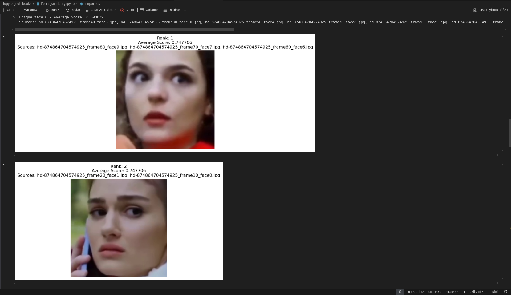
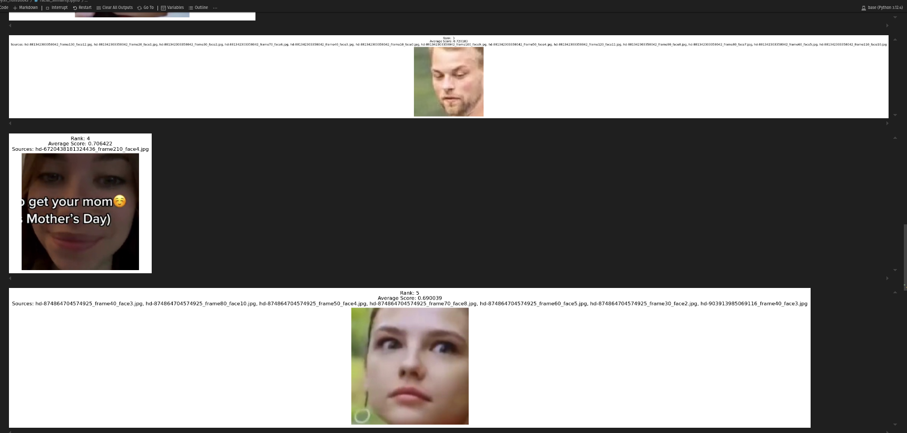

# Influencer Face Metrics Analysis

The aim of this project is to analyse why some videos are performing better for social media metrics.

# Output

# Steps to process data

1. Downloaded the videos from the csv file to the videos folder and stored the performance score of each video in a txt file in the performances folder.

2. Using a script utilising hashing and video frame checking unique videos and scores are stored in a similar manner.

3. Normalization of the scores is done for it to be in the range 0 to 1.

4. Now from the unique videos, a list of faces along with their performance scores are listed down in a txt file with the same name.

5. Using dlib and Resnet models, facial similarity is checked with a threshold value of 93% match.

6. Unique faces and their scores from the respective videos are found. In this case multiple video sources are listed in case face is seen multiple times.

7. Based on these scores top N influencers are shown (5 in this project).

